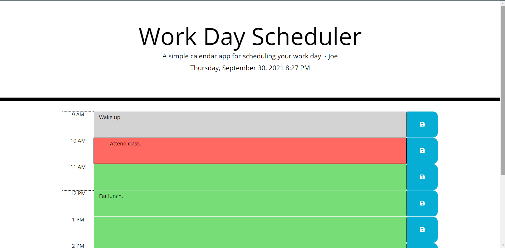

## Word Day Scheduler

# Description

This web app allows for scheduling of tasks through textarea input and saving data to local storage. The app consists of time "blocks" for each hour between 9AM and 5PM. Each time block is colored depending on the time of day: gray if the current time has surpassed the time block, red if the current time is equal to the time block, and green if the current time has not passed the time block.

# Usage

To use the web app, enter a task in any time block colored area and save it to local storage by pressing the blue save button to the right of the block.

# Links and Screenshot

GitHub Pages: https://jwhector.github.io/work-day-scheduler/

GitHub Repo: https://github.com/jwhector/work-day-scheduler